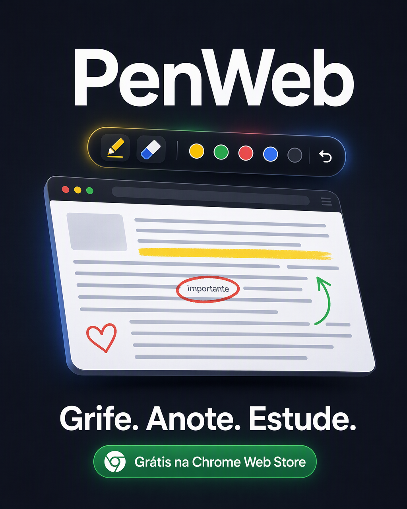

# PenWeb

**Grife, desenhe e anote em qualquer página da web.**

PenWeb é uma extensão para Chrome (Manifest V3) que transforma qualquer página —
videoaulas, PDFs no navegador, apostilas, artigos — em um quadro de estudos.
Todo o conteúdo é processado e armazenado **localmente no navegador do usuário**:
nenhum dado pessoal é coletado ou transmitido.

🔗 [Chrome Web Store](https://chromewebstore.google.com/detail/penweb/mmbhcihaimenkcagobpnkopbhdcgpopd) ·
🌐 [Site oficial](https://thallyz.github.io/penweb/) ·
🇬🇧 [English site](https://thallyz.github.io/penweb/en/)



## Recursos

- **Caneta com pressão** — espessura, cor e opacidade ajustáveis, traço suavizado.
- **Marca-texto** — destaque trechos sem alterar o DOM original da página.
- **Captura real da tela** — exporta a anotação junto com o conteúdo visível em PNG.
- **Autosave por URL** — ao recarregar a página, o desenho da sessão pode ser restaurado.
- **Interface trilíngue** — português, inglês e espanhol, detectados pelo idioma do navegador.
- **Acessibilidade** — alto contraste, escala de interface e respeito a `prefers-reduced-motion`.

## Sobre este repositório

Este repositório contém o **site oficial** do PenWeb (página estática, HTML + CSS puros,
hospedada no GitHub Pages) e a **configuração remota** consumida pela extensão.

```
penweb/
├── index.html          # página principal (pt-BR)
├── privacidade.html    # política de privacidade (pt-BR)
├── ofertas.json        # configuração remota do painel de ofertas da extensão
├── en/
│   ├── index.html      # página principal (en)
│   └── privacy.html    # política de privacidade (en)
├── css/
│   └── style.css       # folha de estilos (variáveis de tema no topo)
└── img/                # pôster e banner (Open Graph)
```

### Internacionalização

As versões pt-BR e en são páginas independentes ligadas por `hreflang`
(`pt-BR`, `en`, `x-default`), permitindo que cada idioma seja indexado
corretamente. A interface da extensão usa um dicionário próprio (`pt` / `en` / `es`)
resolvido em tempo de execução pelo idioma do navegador.

### Configuração remota (`ofertas.json`)

O painel de ofertas exibido pela extensão é alimentado por este arquivo, servido
pelo raw do GitHub. O fluxo no content script é:

1. leitura do cache em `localStorage` (chave `penweb_ofertas_cache`, TTL de 6 h);
2. se o cache estiver ausente ou expirado, `fetch` de `ofertas.json`;
3. validação do payload (campos `emoji`, `texto`, `cta` e `link` com URL http/https);
4. em caso de falha de rede ou payload inválido, mantém a lista embutida de fallback.

Esse desenho permite atualizar o conteúdo do painel **sem publicar uma nova
versão da extensão na loja**.

## Privacidade

Nenhuma coleta de dados pessoais, histórico ou conteúdo de páginas. As anotações
vivem apenas no `localStorage` do dispositivo. Detalhes em
[privacidade.html](https://thallyz.github.io/penweb/privacidade.html)
([English](https://thallyz.github.io/penweb/en/privacy.html)).

## Roadmap

- [x] Chrome (Manifest V3) — publicado
- [ ] Edge Add-ons
- [ ] Firefox
- [ ] Safari
- [ ] PenWeb AI — explicação de grifos, mapas mentais e flashcards (linha premium)

## Contribuições

Issues e pull requests são bem-vindos: correções de texto, traduções, acessibilidade
e melhorias do site são os pontos de entrada mais úteis hoje. Para problemas da
extensão, abra uma issue descrevendo navegador, versão e passos para reproduzir.

## Contato

youthman95@gmail.com

---

<details>
<summary><strong>English</strong></summary>

**Highlight, draw and annotate on any web page.** PenWeb is a Chrome extension
(Manifest V3) that turns any page — video lectures, in-browser PDFs, handouts,
articles — into a study whiteboard. Everything is processed and stored
**locally in the user's browser**; no personal data is collected or transmitted.

This repository holds the official static website (GitHub Pages) and the remote
configuration (`ofertas.json`) consumed by the extension, which is fetched with a
6-hour `localStorage` cache and an embedded fallback so the offer panel can be
updated without republishing the extension.

Install: [Chrome Web Store](https://chromewebstore.google.com/detail/penweb/mmbhcihaimenkcagobpnkopbhdcgpopd) ·
Privacy: [policy](https://thallyz.github.io/penweb/en/privacy.html)

</details>
